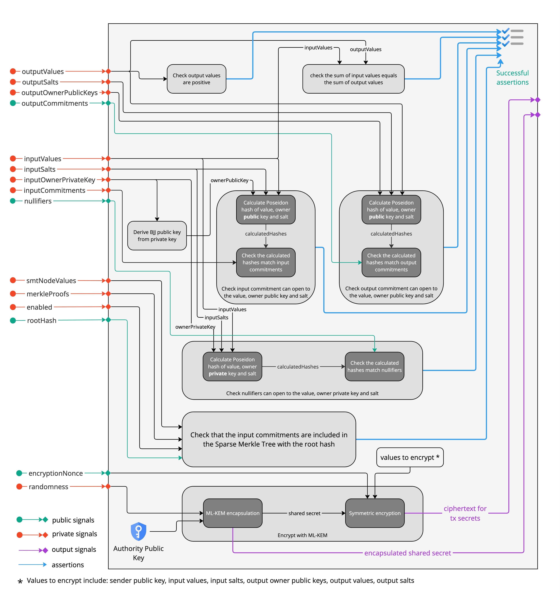

# Zeto_AnonNullifierQurrency

| Anonymity          | History Masking    | Encryption         | KYC | Non-repudiation | Gas Cost (estimate) |
| ------------------ | ------------------ | ------------------ | --- | --------------- | ------------------- |
| :heavy_check_mark: | :heavy_check_mark: | :heavy_check_mark: | -   | -               | 2,066,430           |


This implementation builds on top of the `anon_nullifiers` to add post-quantum cryptography inside the circuit to encrypt sensitive information for a designated authority, such as a regulator, for auditing purposes.

To implement post-quantum secure encryption, these circuits use the public key encryption scheme internal to ML-KEM (Module-Lattice-Based Key-Encapsulation Mechanism), which is derived from the CRYSTALS-KYBER algorithm. This algorithm has been selected by NIST for standardization of post-quantum secure encryption, meaning even quantum computers cannot break the cryptosystem.

The encryption is performed in the follow step, according to the ML-KEM scheme:

- An AES-256 encryption key is generated for the transaction. This key is used only for this transaction
  - AES-256 is a quantum-secure block cipher.
- The secrets meant for the auditing authority are encrypted with this key, and sent as part of the transaction payload
- The key is passed into the circuit as a private input and encrypted inside the circuit under the ML-KEM scheme, using the auditing authority's public key
  - The public key is statically programmed into the circuit. This is to avoid making it a signal which would be very inefficient due to the large size of the public key (1184 bytes)
  - <span style="color:red">IMPORTANT:</span> This means for a real world deployment, the deployer MUST update the circuit with the auditing authority's public key and re-compile the circuit
- The ciphertext is extracted from the circuit's witness array and sent as a part of the transaction payload
- The circuit also calculates the SHA256 hash of the ciphertext to use as a public input, instead of using the ciphertext itself as a public input
  - This is an optimization step. The ciphertext is a large array of 768 numbers (of value 0 or 1), to represent the 768-bit ciphertext, which would make proof verification more expensive
  - The SHA256 hashing algorithm is picked to make verification inside EVM more efficient, due to the native sha256 support via EVM precompiles.
- The authority can then use the private key to decrypt the ciphertext to recover the AES encryption key, then use the recovered key to decrypt the AES ciphertext to recover the secrets

The statements in the proof include:

- each value in the output commitments must be a positive number in the range 0 ~ (2\*\*40 - 1)
- the sum of the nullified values match the sum of output values
- the hashes in the output match the hash(value, salt, owner public key) formula
- the sender possesses the private BabyJubjub key, whose public key is part of the pre-image of the input commitment hashes, which match the corresponding nullifiers
- the nullifiers represent input commitments that are included in a Sparse Merkle Tree represented by the root hash
- the AES encryption key is correctly encrypted using the auditing authority's public key, resulting in the ciphretext
- the public signals representing the SHA256 hash of the ciphertext is correctly calculated

[](../images/circuit_wiring_anon_nullifier_qurrency.jpg)

# Zero-Knowledge Circuit Setup

In order to initialize a zero-knowledge proof circuit corresponding to a particular auditor, we require information about the auditor's ML-KEM public key to be encoded into the circuit.

## Background

[ML-KEM](https://nvlpubs.nist.gov/nistpubs/FIPS/NIST.FIPS.203.pdf) is a key-encapsulation mechanism, which internally initializes and uses a public key encryption scheme referred to as K-PKE. The Qurrency protocol uses this internal PKE scheme to provide post-quantum secure public key encryption. K-PKE was chosen because to date it is the only post-quantum secure PKE scheme to appear in a NIST standardization. It has been selected for standardization as a standalone post-quantum secure PKE scheme, and the standardization process is expected to complete by 2027.

For any implementation, calling $\mathsf{ML\mathrm{-}KEM}.\mathsf{KeyGen}()$ will return an encapsulation key `ek` and a decapsulation key `dk`. Since `ek` is identical to the public key of the internal PKE scheme, we can directly use `ek` to build the ZK circuit. `ek` is an array of 800 bytes, of the following form:

- The first 768 bytes encode an array `t` of 512 integers modulo a prime $q$, where $q = 3329$. Each integer is encoded in 12 bits.
- The remaining 32 bytes is used as a random seed `rho`, which generates a matrix `a`. This is a 2x2 matrix, where each element is an array of 256 integers mod $q$.

Our circuits are designed for ML-KEM-512 in particular, so all parameters are chosen relative to this scheme.

## Circuit generation

For this example, we'll demonstrate the circuit generation process using the `mlkem` [npm module](https://www.npmjs.com/package/mlkem), although any secure ML-KEM implementation will suffice. After generating your keys:

```javascript
const mlkem = new MlKem512();
const [ek, dk] = await mlkem.generateKeyPair();
```

Securely store `dk` to use in audits. (In particular, auditing requires the first 768 bytes of `dk`, which corresponds to the private key of the PKE scheme.) Then setup the `kyber.circom` circuit inside `zkp/circuits/lib/kyber` with the following steps.

1. Separate `ek` into `t` (the first 768 bytes) and `rho` (the remaining 32 bytes).
2. For each 384-byte half `ti` of `t`, compute `polyFromBytes(ti)`. This is the `mlkem` implementation of $\mathsf{ByteDecode}_{12}$ from the ML-KEM specification. It decodes the two halves of `t` back into arrays of integers. These two arrays can be inserted as `t[0]` and `t[1]` inside the `kyber_enc` circuit.
3. Compute the matrix `a` as `_sampleMatrix(rho, false)`. In the ML-KEM specification, each entry `a[i,j]` of `a` is computed as $\mathsf{SampleNTT}(\rho \mathbin\Vert j \mathbin\Vert i)$. In `mlkem`, this function computes all four entries of `a` at once. These can then be inserted into the corresponding `a[0][0]`, `a[0][1]`, `a[1][0]`, and `a[1][1]` inside the `kyber_enc` circuit.

After this, circuit generation is complete, and setup can continue the same as all other Zeto tokens.

**Note**: The `_sampleMatrix` function is not exposed by the `mlkem` library for external use, so for circuit initialization, you may have to either re-implement this functionality, or temporarily modify the library to expose this.
